# 8-Bit Timer

## Overview

### Introduction

This 8-bit timer project is a simple project for getting familiar with the design verification and implementation module using systemVerilog.

From this project, you will learn how to:
- Design a simple timer module with APB interface
- Implement the timer functionality with different modes (count up, count down, clock division) and handle APB transactions and error responses
- Build environment for testing the module
- Use simple perl scripts to automate running simulations and checking results
- Develop a testbench using simple SystemVerilog constructs
- Use both functional and code coverage to ensure the quality of the design

### Main Features

The 8-bit timer has the following main features:
- 8-bit counter with count up and count down mode
- Register set is configured via APB interface (IP is APB slave)
- Support level:
  - Supported wait state (1 cycle)
  - error handling

Timer uses an active low asynchronous reset signal (PRESETN) 

Counter can be counted base on KER_CLK or divided up to 8

Support timer interrupt generation (can be enabled or disabled)

Two clock domain:
- One for register configuration (PCLK): 50 MHz
- One for clock divisor (KER_CLK): 200 MHz

### Block Diagram

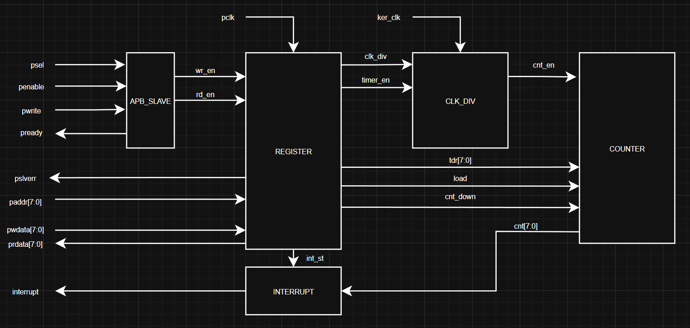

### Interface signals
| Signal name| Width | Direction | Discription |
|:---:|:---:|:---:|:---:|
| KER_CLK | 1 | Input | Kernel clock |
| PCLK | 1 | Input | Peripheral clock |
| PRESETN | 1 | Input | Active low reset |
| PADDR | 8 | Input | APB address bus |
| PSEL | 1 | Input | APB select signal |
| PENABLE | 1 | Input | APB enable signal |
| PWRITE | 1 | Input | APB write signal |
| PWDATA | 8 | Input | APB write data bus |
| PREADY | 1 | Output | APB ready signal |
| PRDATA | 8 | Output | APB read data bus |
| INT | 1 | Output | Interrupt signal |
| PSLVERR | 1 | Output | APB error signal |

# Register Specification

## Register Summary
| Offset | Abbreviation | Register Name | Description |
|:---:|:---:|:---:|:---:|
| 0x00 | TCR | Timer Configuration Register | - |
| 0x01 | TSR | Timer Status Register | - |
| 0x02 | TDR | Timer Data Register | - |
| 0x03 | TIE | Timer Interrupt Enable Register | - |
| 0x04 -> 0xFF | Reserved Region | - | Write not affected, Read as Zero |

## Timer Configuration Register (TCR)
offset: 0x00

Reset value: 0x00
| Bit | Name | Type | Default value | Description |
|:---:|:---:|:---:|:---:|:---
| 7:5 | Reserved | RO | 3'b0 | Reserved |
| 4:3 | clk_div | RW | 2'b00 | Clock divisor. Divides KER_CLK and supplies to Counter block: • 2'b00: No divide • 2'b01: Divide by 2 (100 MHz to Counter) • 2'b10: Divide by 4 (50 MHz to Counter) • 2'b11: Divide by 8 (25 MHz to Counter)   clk_div is prohibited when timer_en is High. Access is error response in this case|
| 2 | load | RW | 1'b0 | Load data from TDR into Counter as initial value:  • 1'b1: Load data to Counter • 1'b0: Normal operation   When write value of this bit is 1, Counter will stop counting and data in TDR will load into counter    load is prohibited when timer_en is High. Access is error response in this case|
| 1 | count_down | RW | 1'b0 | Timer count direction.   1: Count down   0: Count up   count_down is prohibited when timer_en is High. Access is error response in this case|
| 0 | timer_en | RW | 1'b0 | Timer count enable   1: Timer enabled  0: Timer disabled   prohibited when|

This is the main design of TCR register with clock input from PCLK domain:

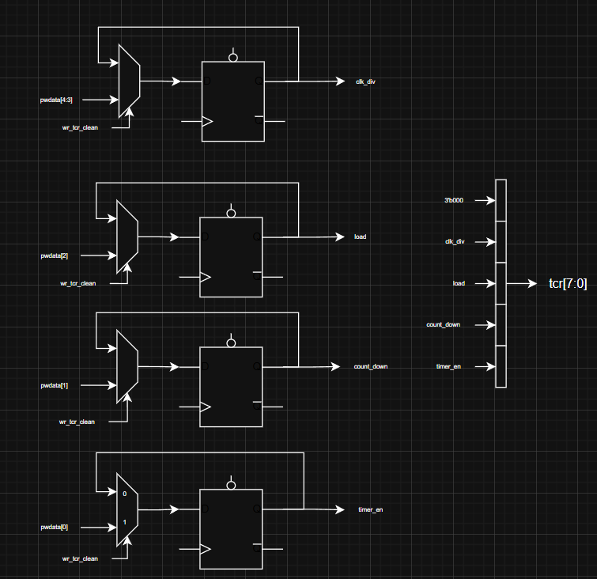

In the TCR register also has some signals included:
- wr_tcr: this signal means write to TCR register
- pslverr: this signal prevent the access to TCR register when timer_en is High and output error response to APB bus
- falling_edge: this signal is used to detect the falling edge of timer_en signal and send to the counter block to reset itself.

Picture of submode of TCR register:

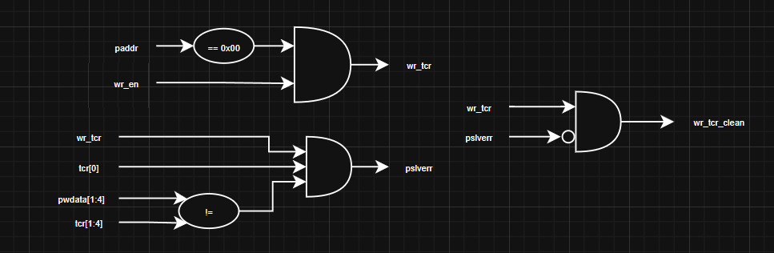
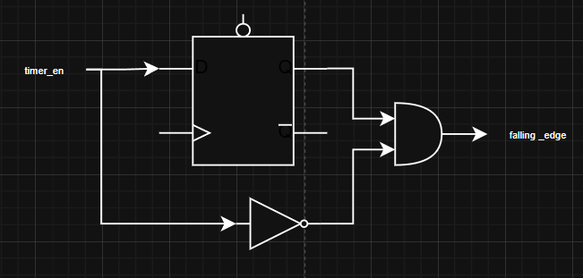

## Timer Status Register (TSR)
offset: 0x01

Reset value: 0x00
| Bit | Name | Type | Default value | Description |
|:---:|:---:|:---:|:---:|:---
| 7:2 | Reserved | RO | 6'b0 | Reserved |
| 1 | underflow | RW1C | 1'b0 | Underflow flag.   This will trigger when Counter transit from 0x00 to 0xFF   Write 1'b1 to clear this flag |
| 0 | overflow | RW1C | 1'b0 | Overflow flag.   This will trigger when Counter transit from 0xFF to 0x00   Write 1'b1 to clear this flag |

This is the main design of TSR register with clock input from PCLK domain:

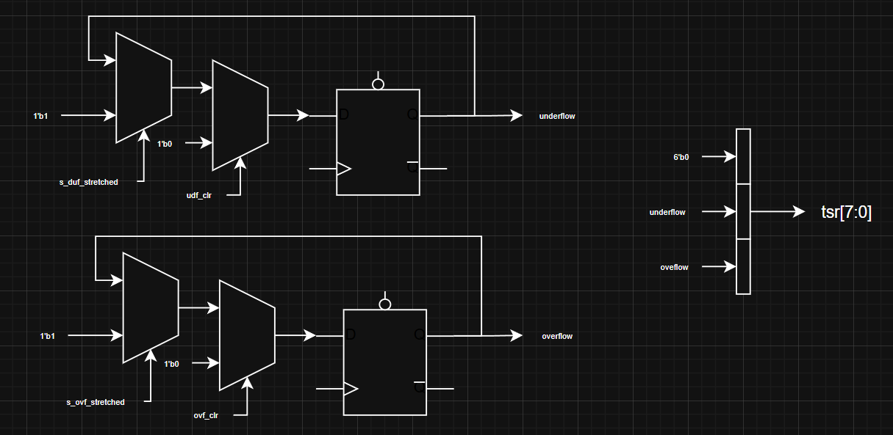

In the TSR register also has some signals included:
- s_ovf_stretched: this signal from the INTERRUPT block (explained later)
- s_udf_stretched: this signal from the INTERRUPT block (explained later)
- ovf_clr: this signal is used to clear overflow flag when write 1 to overflow bit
- udf_clr: this signal is used to clear underflow flag when write 1 to underflow bit

This is the design how to generate ovf_clr and udf_clr signal:

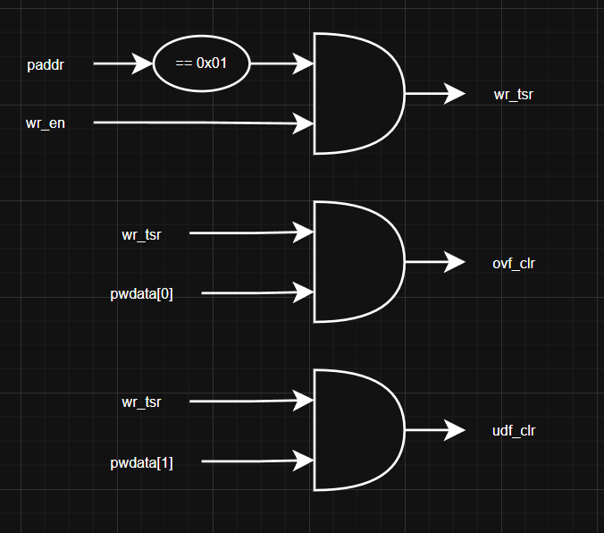

## Timer Data Register (TDR)
offset: 0x02

Reset value: 0x00
| Bit | Name | Type | Default value | Description |
|:---:|:---:|:---:|:---:|:---
| 7:0 | data | RW | 8'b0 | Data load into Counter when TCR bit 2 (load) is set. |

This is the main design of TDR register with clock input from PCLK domain:

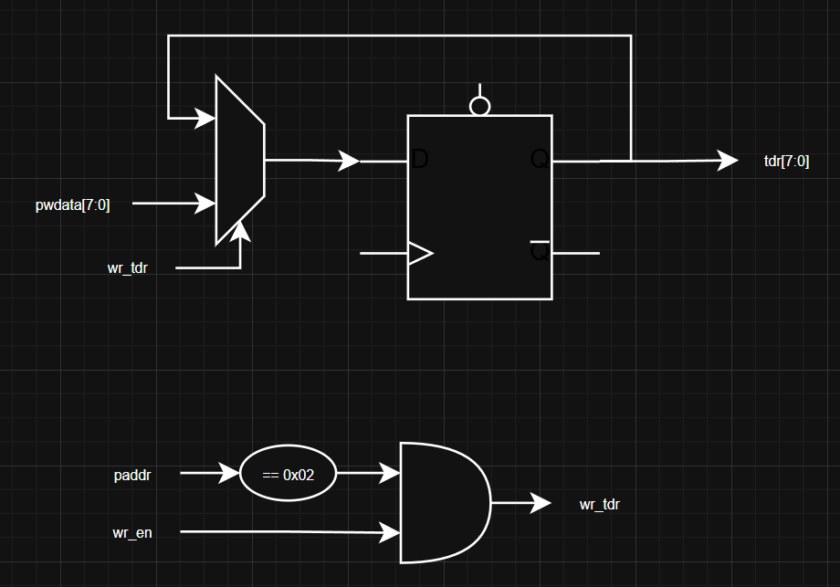

## Timer Interrupt Enable Register (TIE)
offset: 0x03

Reset value: 0x00
| Bit | Name | Type | Default value | Description |
|:---:|:---:|:---:|:---:|:---
| 7:2 | Reserved | RO | 6'b0 | Reserved |
| 1 | underflow_en | RW | 1'b0 | Underflow interrupt enable.   This bit is allow interrupt signal is trigger when underflow status triggered. Otherwise, the interrupt signal will not. |
| 0 | overflow_en | RW | 1'b0 | Overflow interrupt enable.   This bit is allow interrupt signal is trigger when overflow status triggered. Otherwise, the interrupt signal will not. |

This is the main design of TIE register with clock input from PCLK domain:

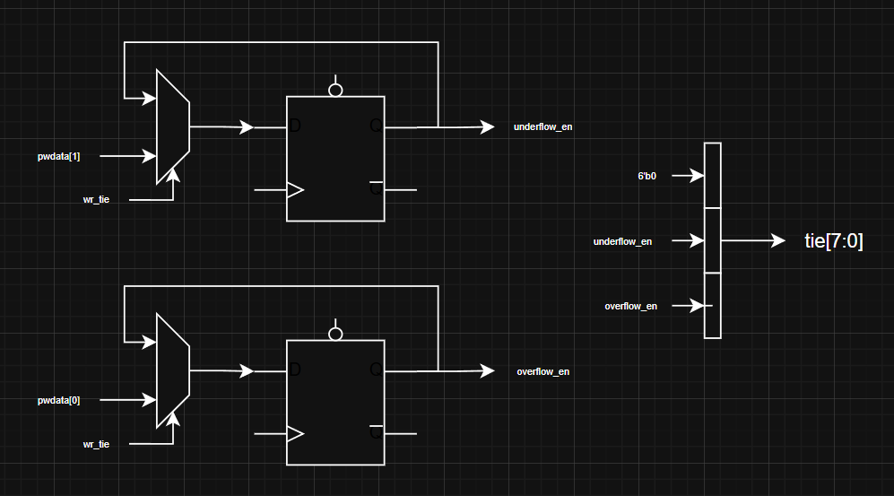

The wr_tie signal has the design:

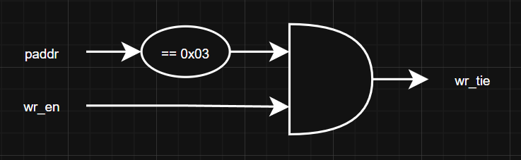

# Functional Description
## APB Interface
The Timer IP uses an APB slave interface to receive configurations from the user and communicate with the system bus. This APB slave supports advanced features, including:
- 8-b address bits
- 8-b read/write data bus
- Support for a 1-cycle wait state (PREADY). 
- Error response (PSLVERR) when accessing prohibited registers or when timer is enabled

This is the first case (access data case):

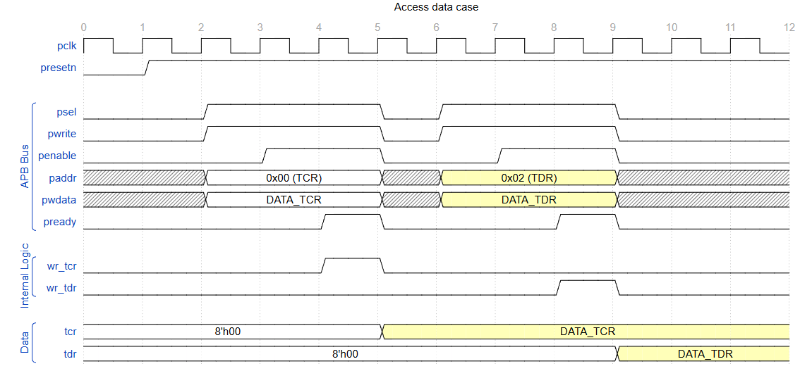

This is the second case (read data case):

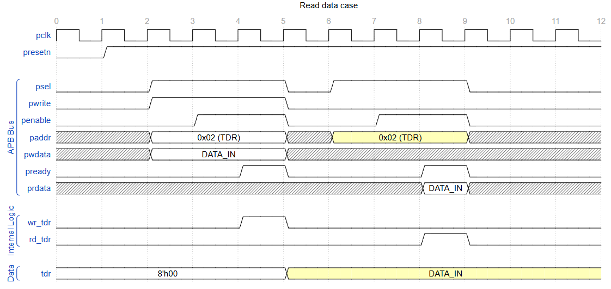

This is the third case (error response case):

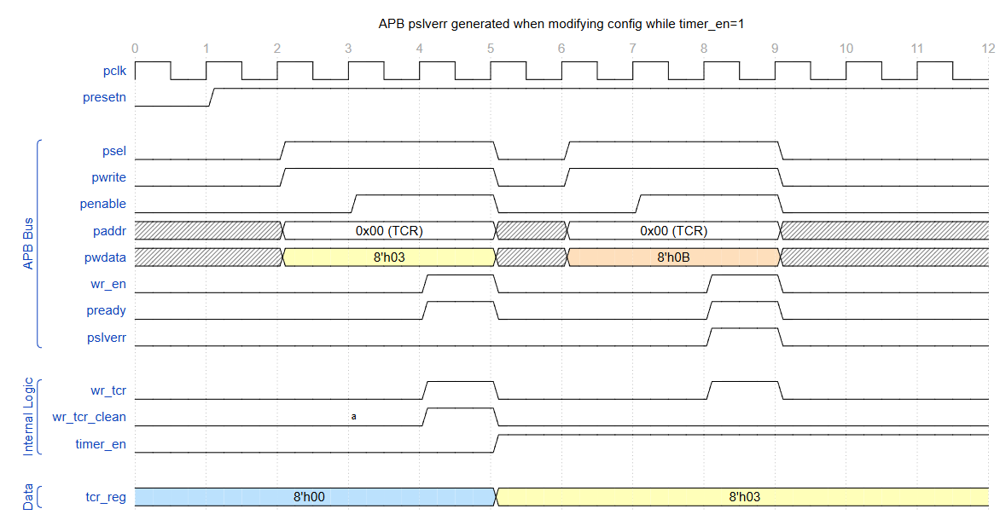

The main functional feauture of this APB_SLAVE is to generate the wr_en, rd_en and pready signal. This also connect the pslverr from TCR to the response signal of APB_SLAVE. The design of APB_SLAVE is shown below:

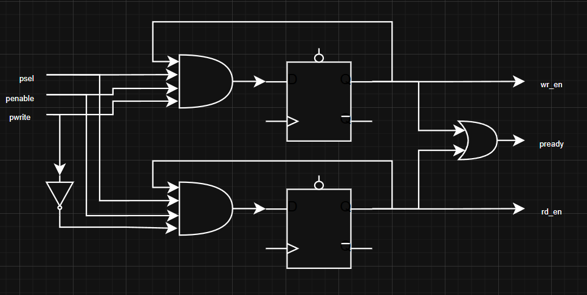

## CLK_DIV Block
The CLK_DIV block is used to generate the cnt_en signal for Counter block and control the counting speed of the timer. The cnt_en signal is generated based on the KER_CLK and the clk_div setting in TCR register. 

This case is when clk_div is 2'b00 (no divide):

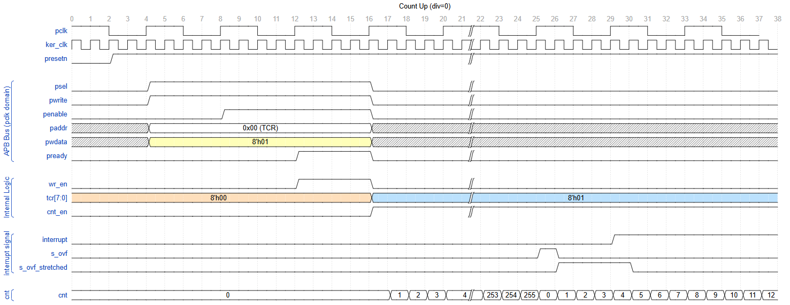

This case is when clk_div is 2'b10 (divide by 4):

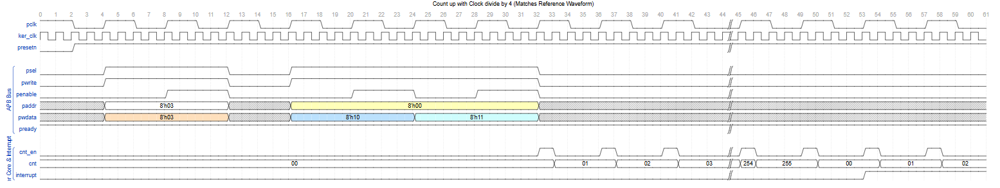

The design of CLK_DIV block is shown below:

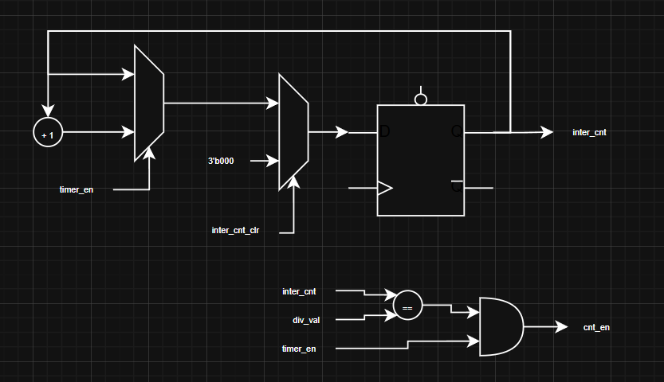

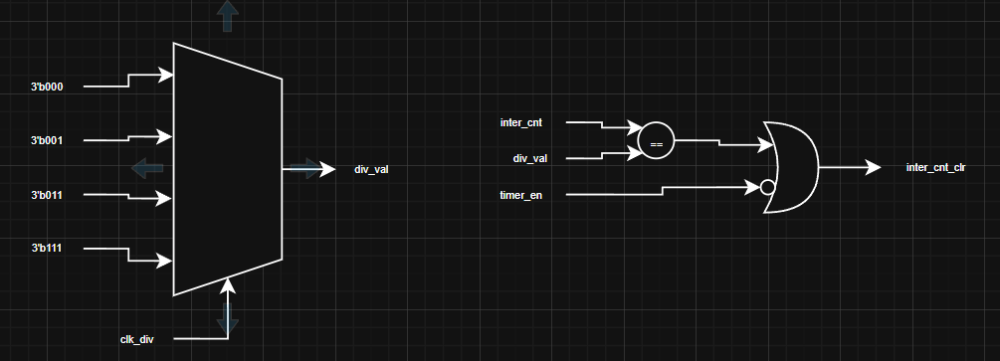

## 8-Bit Counter
The Counter block is the main block of the timer IP. It is responsible for counting based on the cnt_en signal from CLK_DIV block and the count direction (count up or count down) from TCR register. The output cnt[7:0] is the current count value of the timer will be sent to INTERRUPT block to generate the interrupt signal when overflow or underflow happens.

The design of Counter block is shown below:

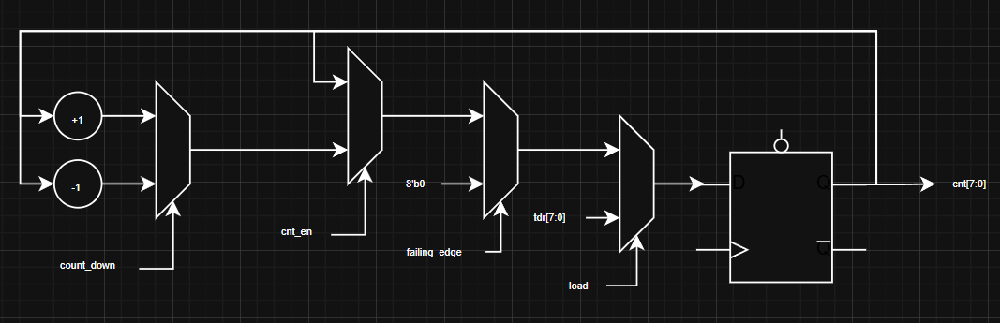

To show how it work you can review the waveform in the CLK_DIV block section. 

## Interrupt Generation

The INTERRUPT block is responsible for generating the interrupt signal based on the overflow and underflow status from TSR register and the interrupt enable settings from TIE register.

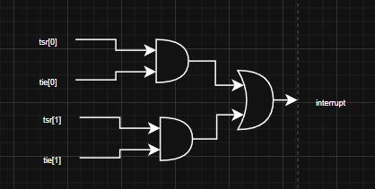

Because in the 8b-timer design has 2 different clock domain (pclk and ker_clk), we create a Pulse Stretcher to hold the interrupt signal longer to make sure the interrupt signal can be captured in the pclk domain when the interrupt happen in ker_clk domain. The design of Pulse Stretcher is shown below:

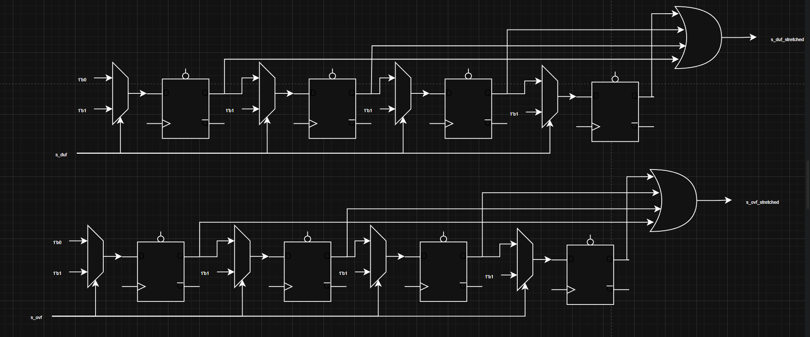

The s_ovf signal create when the:
- load = 0 and cnt_en = 1;
- cnt[7:0] == 8'hFF
- count_down = 0

The s_udf signal create when the:
- load = 0 and cnt_en = 1;
- cnt[7:0] == 8'h00
- count_down = 1

Here is the design of how to generate s_ovf and s_udf signal:

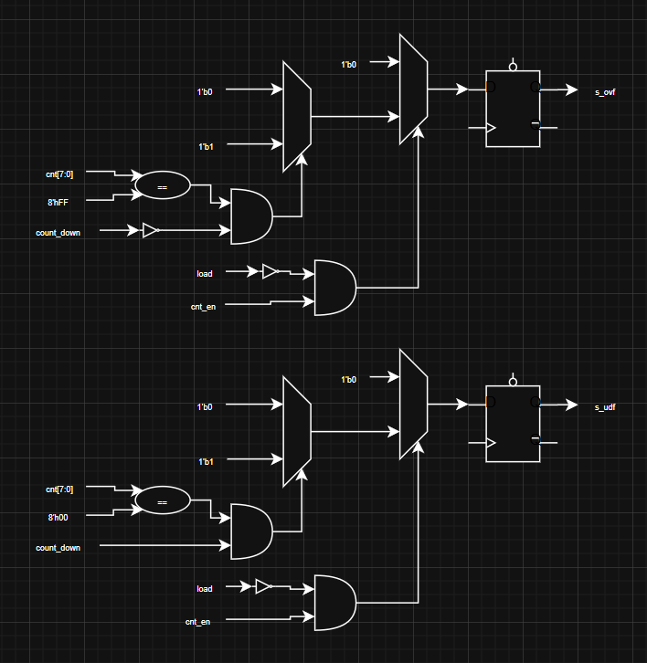

# History of Changes
| Version | Date | Author | Description |
|:---:|:---:|:---:|:---
| 1.0 | June 4, 2026 | LuanNguyen | Initial version |